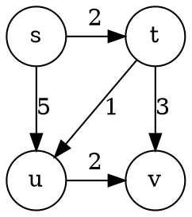
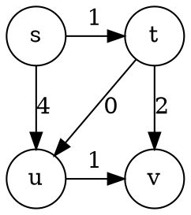

*Eigentlich sollte dieser Algorithmus eine Variante des Dij-Algorithmus sein --> Heap-optimierter Dij-Algorithmus, in dieser Datenstruktur hat es das Verhalten des ersten Eingangs, des größten Ausgangs. Das heißt, im Dij-Algorithmus ist der Abstand zwischen einem Knoten und dem Startpunkt s die Priorität. Je kürzer der Abstand ist, desto höher ist die Priorität.  
Außerdem ist der Knoten, der aus dem Heap ausgeworfen wurde, nicht der Knoten, der den kürzesten Pfad ermittelt hat, und seine Abstand( z.B. s -> ···-> v ) kann anschließend aktualisiert werden. Das heißt, Knoten dürfen erneut in die Warteschlange eingegangen werden.  
Für den Graphen mit negativ gewichteten Kanten, aber keinen negativ gewichteten Schleifen, der Dij-Algorithmus von Prioritätswarteschlangenoptimierung + Wiedereintritt zulassen (dh oben) kann das richtige Ergebnis berechnen. Dies ist jedoch tatsächlich ein Bellman-Ford-Algorithmus mit Prioritätswarteschlange.* 

# Aufgabe 1

<table align="center">
<tr>
    <td>s</td>
    <td>u</td>
    <td>t</td>
    <td>v</td>
    <td>w</td>
    <td>x</td>
    <td>kürzeste Weg</td>
</tr>
<tr>
    <td>0</td>
    <td>1</td>
    <td>5</td>
    <td>7</td>
    <td>∞</td>
    <td>∞</td>
    <td>{s}</td>
</tr>
<tr>
    <td>0</td>
    <td>1</td>
    <td>5</td>
    <td>7</td>
    <td>∞</td>
    <td>2</td>
    <td>{s,u}</td>
</tr>
<tr>
    <td>0</td>
    <td>1</td>
    <td>5</td>
    <td>7</td>
    <td>8</td>
    <td>2</td>
    <td>{s,u,x}</td>
</tr>
<tr>
    <td>0</td>
    <td>1</td>
    <td>4</td>
    <td>7</td>
    <td>8</td>
    <td>2</td>
    <td>{s,u,x,t}</td>
</tr>
<tr>
    <td>0</td>
    <td>1</td>
    <td>4</td>
    <td>7</td>
    <td>8</td>
    <td>2</td>
    <td>{s,v}</td>
</tr>
<tr>
    <td>0</td>
    <td>1</td>
    <td>4</td>
    <td>7</td>
    <td>7</td>
    <td>2</td>
    <td>{s,u,t,w}</td>
</tr>
</table>

# Aufgabe 2  
## (a)  
Nach Dijkstras Algorithmus durchgeläuft, sieht die Ergebnis so aus.  

<table>
   <tr>
      <td>s</td>
      <td>t</td>
      <td>u</td>
      <td>v</td>
      <td></td>
   </tr>
   <tr>
      <td>0</td>
      <td>4</td>
      <td>2</td>
      <td>∞</td>
      <td>{s}</td>
   </tr>
   <tr>
      <td>0</td>
      <td>4</td>
      <td>2</td>
      <td>3</td>
      <td>{s,u}</td>
   </tr>
   <tr>
      <td>0</td>
      <td>4</td>
      <td>2</td>
      <td>1</td>
      <td>{s,t,v}</td>
   </tr>
   <tr>
      <td>0</td>
      <td>4</td>
      <td>2</td>
      <td>1</td>
      <td>{s,t}</td>
   </tr>
</table>

## (b)
<h4>G1</h4>

    

<table>
   <tr>
      <td>s</td>
      <td>t</td>
      <td>u</td>
      <td>v</td>
      <td></td>
   </tr>
   <tr>
      <td>0</td>
      <td>2</td>
      <td>5</td>
      <td>∞</td>
      <td>{s}</td>
   </tr>
   <tr>
      <td>0</td>
      <td>2</td>
      <td>5</td>
      <td>5</td>
      <td>{s,t}</td>
   </tr>
   <tr>
      <td>0</td>
      <td>2</td>
      <td>3</td>
      <td>5</td>
      <td>{s,t,u}</td>
   </tr>
   <tr>
      <td>0</td>
      <td>2</td>
      <td>3</td>
      <td>5</td>
      <td>{s,t,v} o. {s,t,u,v}</td>
   </tr>
</table>

<h4>G2</h4>

    

<table>
   <tr>
      <td>s</td>
      <td>t</td>
      <td>u</td>
      <td>v</td>
      <td></td>
   </tr>
   <tr>
      <td>0</td>
      <td>1</td>
      <td>4</td>
      <td>∞</td>
      <td>{s}</td>
   </tr>
   <tr>
      <td>0</td>
      <td>1</td>
      <td>4</td>
      <td>3</td>
      <td>{s,t}</td>
   </tr>
   <tr>
      <td>0</td>
      <td>1</td>
      <td>4</td>
      <td>2</td>
      <td>{s,t,u,v}</td>
   </tr>
   <tr>
      <td>0</td>
      <td>1</td>
      <td>1</td>
      <td>2</td>
      <td>{s,t,u}</td>
   </tr>
</table>

Sei x=-1, nach dem Ausführen des Dij-Algorithmus erschienen unterschiedliche Ergebnisse:  
In G1 gibt es zwei kürzeste Wege von s nach v: s -> t -> v  oder  s -> t -> u -> v  
In G2 gibt es jedoch nur einen kürzesten Weg von s nach v: s -> t -> u -> v  
Wobei s-> t -> v als länger als s -> t -> u -> v beurteilt wird, das ist falsch.
